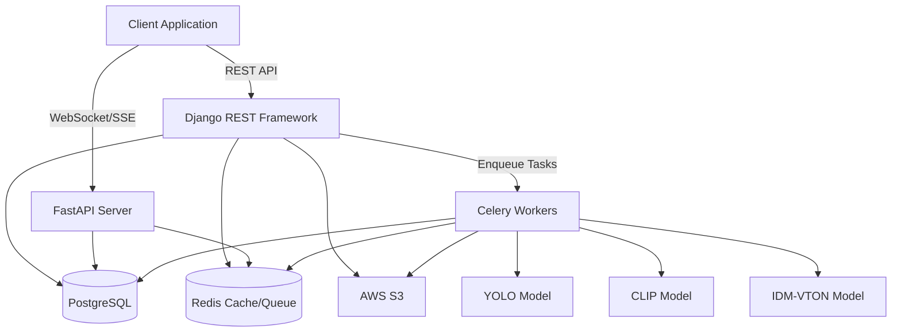
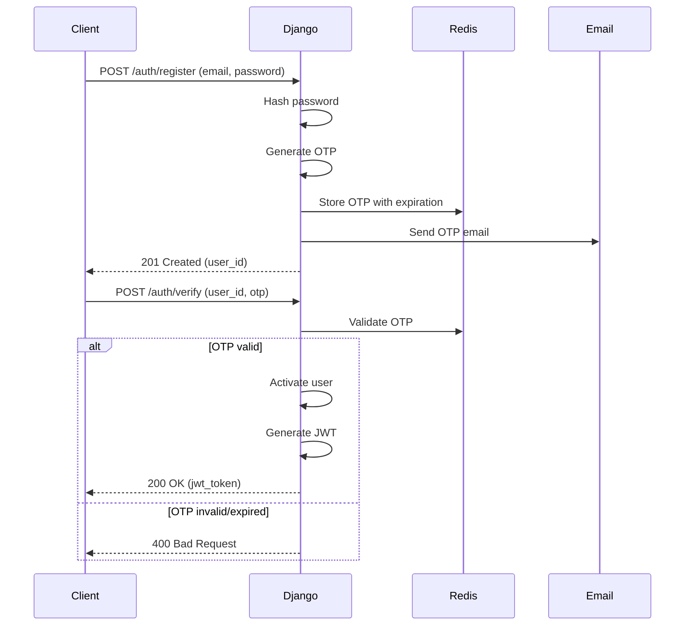
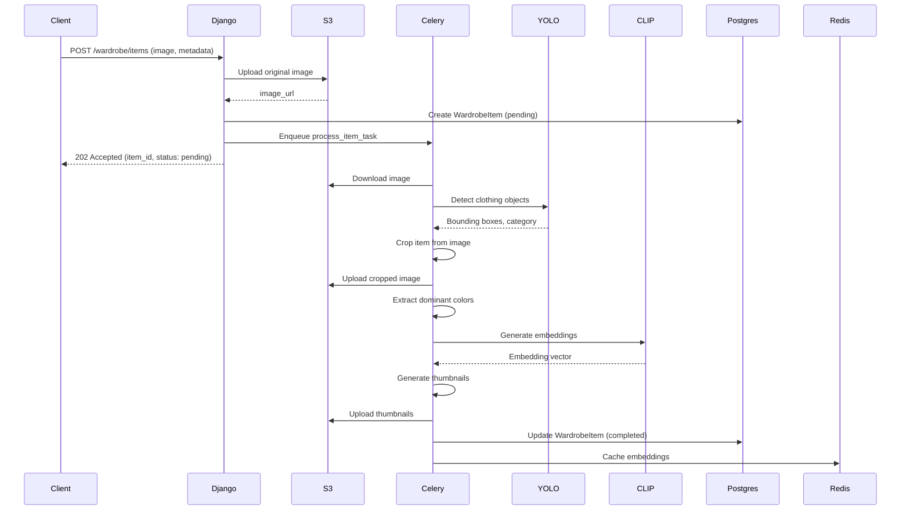
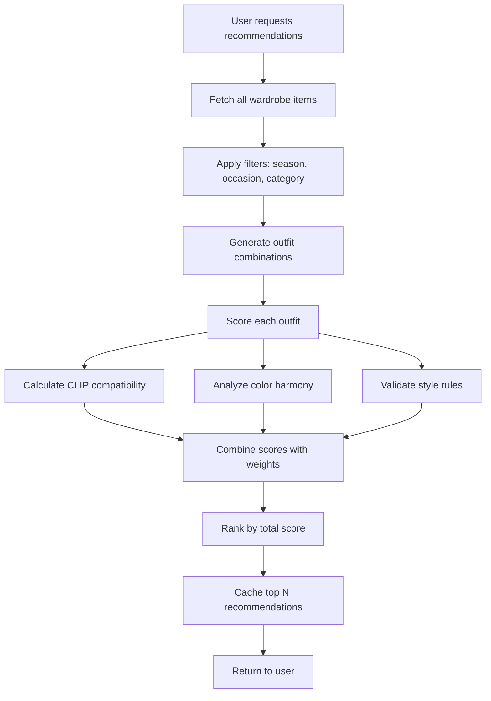
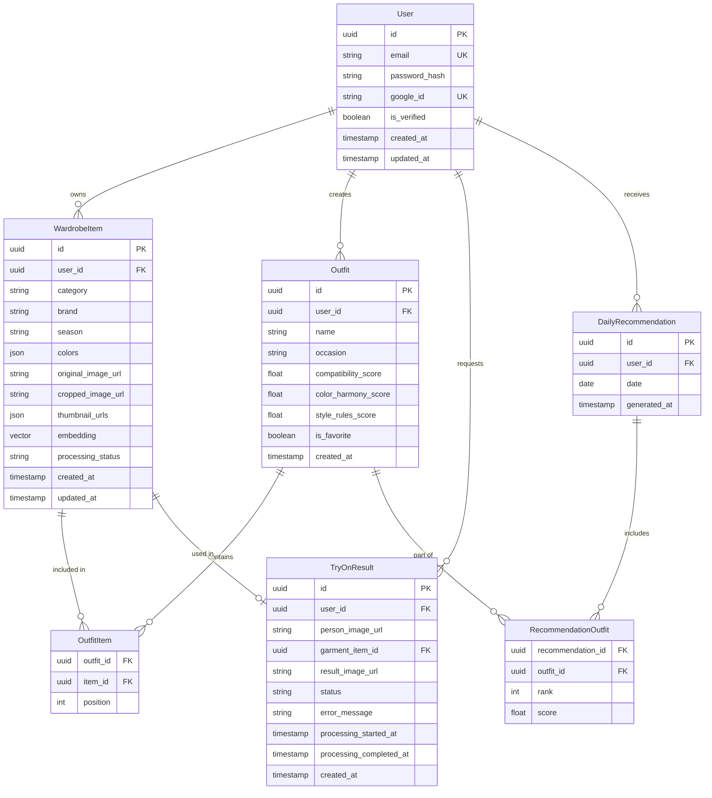

# Design Document: Outfit Stylist Platform

## Overview

The Outfit Stylist Platform is a sophisticated AI-powered fashion assistant that combines computer vision, semantic understanding, and style intelligence. The system architecture follows a microservices-inspired approach with Django REST Framework handling core CRUD operations, FastAPI providing real-time features, and Celery managing compute-intensive AI workloads.

The platform leverages three primary AI models:
- **YOLO**: Object detection for clothing item identification and cropping
- **CLIP**: Semantic embeddings for similarity search and compatibility scoring
- **IDM-VTON**: Virtual try-on image generation

Data flows through a pipeline architecture where user uploads trigger async processing chains, AI models enrich items with metadata and embeddings, and recommendation engines compose outfits using multi-factor scoring algorithms.

## Architecture

### System Components



### Layer Responsibilities

**API Layer (Django REST Framework)**:
- User authentication and authorization (JWT)
- CRUD operations for users, wardrobe items, outfits
- Request validation and serialization
- Database transaction management
- Task enqueueing

**Real-Time Layer (FastAPI)**:
- Async task status polling
- Server-sent events for progress updates
- Low-latency status queries
- WebSocket connections for live updates

**Processing Layer (Celery)**:
- Image processing (cropping, thumbnails)
- AI model inference (YOLO, CLIP, IDM-VTON)
- Batch recommendation generation
- Retry logic and error handling

**Storage Layer**:
- PostgreSQL: Relational data (users, items, outfits, metadata)
- Redis: Cache (embeddings, recommendations), task queue
- S3: Image storage (originals, thumbnails, try-on results)

### Authentication Flow



### Wardrobe Item Processing Pipeline



### Outfit Recommendation Algorithm



## Components and Interfaces

### User Management Component

**Models**:
```python
User:
  - id: UUID
  - email: String (unique, indexed)
  - password_hash: String
  - google_id: String (nullable, unique)
  - is_verified: Boolean
  - created_at: Timestamp
  - updated_at: Timestamp
```

**Interfaces**:
```python
POST /auth/register
  Request: { email, password }
  Response: { user_id, message }

POST /auth/verify
  Request: { user_id, otp }
  Response: { jwt_token, expires_at }

POST /auth/login
  Request: { email, password }
  Response: { jwt_token, expires_at }

GET /auth/google
  Response: Redirect to Google OAuth

GET /auth/google/callback
  Query: { code }
  Response: { jwt_token, expires_at }
```

### Wardrobe Management Component

**Models**:
```python
WardrobeItem:
  - id: UUID
  - user_id: UUID (foreign key, indexed)
  - category: String (enum: top, bottom, dress, shoes, accessory)
  - brand: String (nullable)
  - season: String (enum: spring, summer, fall, winter, all)
  - colors: JSON Array of RGB tuples
  - original_image_url: String
  - cropped_image_url: String
  - thumbnail_urls: JSON Object {small, medium, large}
  - embedding: Vector (1536 dimensions for CLIP)
  - processing_status: String (enum: pending, processing, completed, failed)
  - created_at: Timestamp
  - updated_at: Timestamp
```

**Interfaces**:
```python
POST /wardrobe/items
  Headers: { Authorization: Bearer <jwt> }
  Request: FormData { image: File, category?, brand?, season? }
  Response: { item_id, status, image_url }

GET /wardrobe/items
  Headers: { Authorization: Bearer <jwt> }
  Query: { category?, season?, limit?, offset? }
  Response: { items: [WardrobeItem], total, page }

GET /wardrobe/items/{item_id}
  Headers: { Authorization: Bearer <jwt> }
  Response: WardrobeItem

PUT /wardrobe/items/{item_id}
  Headers: { Authorization: Bearer <jwt> }
  Request: { category?, brand?, season? }
  Response: WardrobeItem

DELETE /wardrobe/items/{item_id}
  Headers: { Authorization: Bearer <jwt> }
  Response: { message }

GET /wardrobe/items/{item_id}/similar
  Headers: { Authorization: Bearer <jwt> }
  Query: { limit? }
  Response: { items: [WardrobeItem with similarity_score] }
```

### Outfit Recommendation Component

**Models**:
```python
Outfit:
  - id: UUID
  - user_id: UUID (foreign key, indexed)
  - name: String
  - occasion: String (enum: casual, formal, business, sport, party)
  - items: JSON Array of item_ids
  - compatibility_score: Float (0.0 to 1.0)
  - color_harmony_score: Float (0.0 to 1.0)
  - style_rules_score: Float (0.0 to 1.0)
  - is_favorite: Boolean
  - created_at: Timestamp

DailyRecommendation:
  - id: UUID
  - user_id: UUID (foreign key, indexed)
  - date: Date (indexed)
  - outfits: JSON Array of outfit_ids with scores
  - generated_at: Timestamp
```

**Interfaces**:
```python
POST /outfits/recommend
  Headers: { Authorization: Bearer <jwt> }
  Request: { occasion?, season?, num_outfits? }
  Response: { recommendations: [Outfit], generated_at }

GET /outfits/daily
  Headers: { Authorization: Bearer <jwt> }
  Query: { date? }
  Response: DailyRecommendation

POST /outfits
  Headers: { Authorization: Bearer <jwt> }
  Request: { name, occasion, item_ids: [UUID] }
  Response: Outfit

GET /outfits
  Headers: { Authorization: Bearer <jwt> }
  Query: { is_favorite?, limit?, offset? }
  Response: { outfits: [Outfit], total, page }

PUT /outfits/{outfit_id}/favorite
  Headers: { Authorization: Bearer <jwt> }
  Request: { is_favorite: Boolean }
  Response: Outfit

DELETE /outfits/{outfit_id}
  Headers: { Authorization: Bearer <jwt> }
  Response: { message }
```

### Virtual Try-On Component

**Models**:
```python
TryOnResult:
  - id: UUID
  - user_id: UUID (foreign key, indexed)
  - person_image_url: String
  - garment_item_id: UUID (foreign key)
  - result_image_url: String (nullable)
  - status: String (enum: pending, processing, completed, failed)
  - error_message: String (nullable)
  - processing_started_at: Timestamp (nullable)
  - processing_completed_at: Timestamp (nullable)
  - created_at: Timestamp
```

**Interfaces**:
```python
POST /tryon
  Headers: { Authorization: Bearer <jwt> }
  Request: FormData { person_image: File, garment_item_id: UUID }
  Response: { tryon_id, status }

GET /tryon/{tryon_id}
  Headers: { Authorization: Bearer <jwt> }
  Response: TryOnResult

GET /tryon/{tryon_id}/status (FastAPI)
  Headers: { Authorization: Bearer <jwt> }
  Response: { status, progress_percent?, result_url? }

GET /tryon/history
  Headers: { Authorization: Bearer <jwt> }
  Query: { limit?, offset? }
  Response: { results: [TryOnResult], total, page }
```

## Data Models

### Entity Relationships



### Database Indexes

**Critical Indexes**:
- `User.email` (unique, B-tree)
- `User.google_id` (unique, B-tree, sparse)
- `WardrobeItem.user_id` (B-tree)
- `WardrobeItem.category` (B-tree)
- `WardrobeItem.embedding` (IVFFlat for vector similarity with pgvector)
- `Outfit.user_id` (B-tree)
- `Outfit.is_favorite` (B-tree, partial where is_favorite=true)
- `TryOnResult.user_id` (B-tree)
- `TryOnResult.status` (B-tree)
- `DailyRecommendation.user_id, date` (composite, unique)

### Caching Strategy

**Redis Key Patterns**:
```
user:{user_id}:wardrobe:items -> List of WardrobeItem IDs (TTL: 1 hour)
user:{user_id}:embeddings:{item_id} -> CLIP embedding vector (TTL: 24 hours)
user:{user_id}:recommendations:{date} -> DailyRecommendation (TTL: 12 hours)
outfit:{outfit_id}:score -> Compatibility scores (TTL: 1 hour)
tryon:{tryon_id}:status -> Processing status (TTL: 1 hour)
otp:{user_id} -> OTP code (TTL: 10 minutes)
```

**Cache Invalidation**:
- Wardrobe item created/updated/deleted → Invalidate `user:{user_id}:wardrobe:*`
- Outfit created/updated → Invalidate `user:{user_id}:recommendations:*`
- Try-on status updated → Update `tryon:{tryon_id}:status`

## AI Pipeline Workflows

### YOLO Object Detection Workflow

**Purpose**: Detect clothing items in uploaded images and extract bounding boxes

**Process**:
1. Load image from S3
2. Preprocess image (resize to 640x640, normalize)
3. Run YOLO inference
4. Filter detections by confidence threshold (>0.5)
5. Select highest confidence detection for primary category
6. Extract bounding box coordinates
7. Crop original image using bounding box with padding
8. Return category label and cropped image

**Categories Detected**:
- Top (shirt, blouse, sweater, jacket)
- Bottom (pants, skirt, shorts)
- Dress (one-piece garments)
- Shoes (footwear)
- Accessory (bags, hats, scarves)

### CLIP Embedding Generation

**Purpose**: Create semantic vector representations for similarity search and compatibility scoring

**Process**:
1. Load cropped item image
2. Preprocess for CLIP (resize to 224x224, normalize)
3. Generate image embedding (1536-dimensional vector)
4. Normalize embedding to unit length
5. Store in database and cache in Redis
6. Index in pgvector for efficient similarity queries

**Similarity Computation**:
```python
def cosine_similarity(embedding_a, embedding_b):
    return dot(embedding_a, embedding_b) / (norm(embedding_a) * norm(embedding_b))

def find_similar_items(query_embedding, user_items, top_k=10):
    similarities = [
        (item, cosine_similarity(query_embedding, item.embedding))
        for item in user_items
    ]
    return sorted(similarities, key=lambda x: x[1], reverse=True)[:top_k]
```

### Outfit Compatibility Scoring

**Purpose**: Evaluate how well items work together in an outfit

**Algorithm**:
```python
def calculate_outfit_score(items):
    # CLIP Compatibility (40% weight)
    clip_score = calculate_clip_compatibility(items)
    
    # Color Harmony (35% weight)
    color_score = calculate_color_harmony(items)
    
    # Style Rules (25% weight)
    rules_score = validate_style_rules(items)
    
    total_score = (
        0.40 * clip_score +
        0.35 * color_score +
        0.25 * rules_score
    )
    
    return {
        'total': total_score,
        'clip': clip_score,
        'color': color_score,
        'rules': rules_score
    }

def calculate_clip_compatibility(items):
    # Pairwise similarity between all items
    pairs = combinations(items, 2)
    similarities = [
        cosine_similarity(item_a.embedding, item_b.embedding)
        for item_a, item_b in pairs
    ]
    return mean(similarities)

def calculate_color_harmony(items):
    colors = [item.colors[0] for item in items]  # Dominant color
    
    # Convert RGB to HSV for harmony analysis
    hsv_colors = [rgb_to_hsv(color) for color in colors]
    
    # Check for complementary (opposite hues)
    # Check for analogous (adjacent hues)
    # Check for triadic (120° apart)
    # Check for monochromatic (same hue, different saturation/value)
    
    harmony_scores = []
    for color_a, color_b in combinations(hsv_colors, 2):
        hue_diff = abs(color_a.hue - color_b.hue)
        
        if 150 <= hue_diff <= 210:  # Complementary
            harmony_scores.append(1.0)
        elif hue_diff <= 30:  # Analogous
            harmony_scores.append(0.9)
        elif 100 <= hue_diff <= 140:  # Triadic
            harmony_scores.append(0.85)
        elif hue_diff <= 10 and abs(color_a.saturation - color_b.saturation) > 0.2:
            harmony_scores.append(0.95)  # Monochromatic
        else:
            harmony_scores.append(0.5)  # Neutral
    
    return mean(harmony_scores)

def validate_style_rules(items):
    score = 1.0
    
    # Rule: Must have at least one top or dress
    has_top_or_dress = any(item.category in ['top', 'dress'] for item in items)
    if not has_top_or_dress:
        score -= 0.3
    
    # Rule: If dress, should not have top or bottom
    has_dress = any(item.category == 'dress' for item in items)
    if has_dress:
        has_top = any(item.category == 'top' for item in items)
        has_bottom = any(item.category == 'bottom' for item in items)
        if has_top or has_bottom:
            score -= 0.4
    
    # Rule: Should have shoes
    has_shoes = any(item.category == 'shoes' for item in items)
    if not has_shoes:
        score -= 0.2
    
    # Rule: Maximum one accessory per type
    accessories = [item for item in items if item.category == 'accessory']
    if len(accessories) > 2:
        score -= 0.1 * (len(accessories) - 2)
    
    return max(0.0, score)
```

### IDM-VTON Virtual Try-On Pipeline

**Purpose**: Generate realistic images of users wearing selected garments

**Process**:
1. Load person image and garment image from S3
2. Preprocess images:
   - Resize to 768x1024 (person)
   - Resize to 768x1024 (garment)
   - Normalize pixel values
3. Run IDM-VTON model:
   - Detect person pose keypoints
   - Segment person body parts
   - Warp garment to match pose
   - Blend garment onto person with diffusion model
4. Post-process result:
   - Enhance image quality
   - Adjust lighting and colors
5. Upload result to S3
6. Update TryOnResult status to completed

**Error Handling**:
- Person not detected → Status: failed, error: "No person detected in image"
- Garment incompatible → Status: failed, error: "Garment type not suitable for try-on"
- Model timeout → Retry up to 3 times, then fail
- GPU OOM → Queue for retry with smaller batch size

## Correctness Properties


*A property is a characteristic or behavior that should hold true across all valid executions of a system—essentially, a formal statement about what the system should do. Properties serve as the bridge between human-readable specifications and machine-verifiable correctness guarantees.*

### Authentication and Authorization Properties

**Property 1: Account creation with valid credentials**
*For any* valid email and password combination, creating a user account should result in a new user record with hashed password and unverified status.
**Validates: Requirements 1.1**

**Property 2: OTP generation and delivery**
*For any* email registration, the system should generate a unique OTP, store it in Redis with expiration, and trigger email delivery.
**Validates: Requirements 1.2**

**Property 3: OTP verification round-trip**
*For any* user account with a valid unexpired OTP, verifying with that OTP should activate the account, while expired or invalid OTPs should leave the account unverified.
**Validates: Requirements 1.3, 1.4**

**Property 4: JWT token lifecycle**
*For any* successful authentication, the system should issue a JWT token that authorizes requests while valid, and rejects requests when expired or tampered with.
**Validates: Requirements 1.6, 1.7, 1.8**

### Wardrobe Management Properties

**Property 5: Image upload and storage**
*For any* uploaded image (wardrobe item or person photo), the system should store it in S3 with a unique key organized by user and type.
**Validates: Requirements 2.1, 4.1, 5.2, 5.3**

**Property 6: Async task creation for processing**
*For any* image upload or try-on request, the system should create an async Celery task and return immediately with a pending status.
**Validates: Requirements 2.2, 4.2, 5.6**

**Property 7: YOLO detection and cropping**
*For any* wardrobe item image containing clothing, YOLO detection should identify the item, extract bounding boxes, and produce a cropped image.
**Validates: Requirements 2.3, 2.4**

**Property 8: CLIP embedding generation**
*For any* detected clothing item, the system should generate a normalized CLIP embedding vector and cache it in Redis.
**Validates: Requirements 2.5, 7.6**

**Property 9: Color extraction**
*For any* processed item image, the system should extract and store the top dominant colors as RGB tuples.
**Validates: Requirements 2.6, 10.1**

**Property 10: Metadata persistence**
*For any* wardrobe item with provided metadata (category, brand, season), the system should associate and persist this data with the item record.
**Validates: Requirements 2.7**

**Property 11: Automatic categorization**
*For any* wardrobe item when AI categorization is enabled, the system should assign a category based on YOLO detection results.
**Validates: Requirements 2.8**

**Property 12: Thumbnail generation**
*For any* wardrobe item, the system should generate multiple thumbnail sizes (small, medium, large) and store them in S3.
**Validates: Requirements 2.9, 5.4**

**Property 13: Wardrobe query completeness**
*For any* user wardrobe query, the system should return all items belonging to that user with complete metadata and image URLs.
**Validates: Requirements 2.10**

**Property 14: Cascading deletion**
*For any* deleted wardrobe item, the system should remove the database record, all S3 images (original, cropped, thumbnails), references from outfits, and related cache entries.
**Validates: Requirements 2.11, 5.9, 9.1**

### Outfit Recommendation Properties

**Property 15: CLIP similarity computation**
*For any* pair of wardrobe items, computing similarity should use cosine similarity between their CLIP embeddings and return a score between 0 and 1.
**Validates: Requirements 3.2, 6.2**

**Property 16: Comprehensive outfit scoring**
*For any* outfit composition, the system should calculate a total compatibility score as a weighted combination of CLIP similarity (40%), color harmony (35%), and style rules validation (25%).
**Validates: Requirements 3.1, 3.3, 3.4, 3.11, 10.3**

**Property 17: Color harmony analysis**
*For any* set of colors in an outfit, the system should evaluate complementary, analogous, triadic, and monochromatic relationships and assign harmony scores accordingly.
**Validates: Requirements 10.2**

**Property 18: Color clash penalty**
*For any* outfit with colors that violate harmony rules, the compatibility score should be lower than the same outfit with harmonious colors.
**Validates: Requirements 10.4**

**Property 19: Filtering by attributes**
*For any* recommendation or search request with filters (season, category, color), the system should return only items matching all specified criteria.
**Validates: Requirements 3.5, 6.5, 6.6**

**Property 20: Ranking by score**
*For any* set of outfits or search results with compatibility scores, the system should order them in descending order by score.
**Validates: Requirements 3.7, 6.4**

**Property 21: Daily recommendation generation**
*For any* user requesting daily recommendations, the system should generate a DailyRecommendation with ranked outfit options and cache it for 12 hours.
**Validates: Requirements 3.6, 7.4**

**Property 22: Outfit persistence**
*For any* outfit favorited or manually created by a user, the system should persist the outfit with all item references and calculated scores.
**Validates: Requirements 3.9, 3.10**

**Property 23: Recommendation display format**
*For any* outfit recommendation returned to a user, the response should include outfit images, compatibility score, and all component items.
**Validates: Requirements 3.8**

### Virtual Try-On Properties

**Property 24: Try-on task lifecycle**
*For any* try-on request, the system should create a task with "pending" status, transition to "processing" when started, and end in either "completed" with result image or "failed" with error message.
**Validates: Requirements 4.4, 4.6, 4.7, 4.8**

**Property 25: IDM-VTON processing**
*For any* try-on task in processing state, the system should invoke IDM-VTON with the person image and garment image to generate a result.
**Validates: Requirements 4.3**

**Property 26: Status polling availability**
*For any* try-on task while processing, the system should allow clients to poll the status endpoint and receive current progress information.
**Validates: Requirements 4.5, 8.3**

**Property 27: Result image accessibility**
*For any* completed try-on result, the system should provide a signed S3 URL that allows access to the result image.
**Validates: Requirements 4.9, 5.5**

**Property 28: FIFO task processing**
*For any* sequence of try-on requests from a user, the system should process them in the order they were submitted using the Celery queue.
**Validates: Requirements 4.10**

### Image Processing and Storage Properties

**Property 29: Image validation**
*For any* uploaded image, the system should validate file format and size before accepting it for processing.
**Validates: Requirements 5.1**

**Property 30: Async task retry logic**
*For any* failed async task, the system should retry up to the configured maximum attempts, and mark as permanently failed if all retries are exhausted.
**Validates: Requirements 5.7, 5.8**

### Semantic Search Properties

**Property 31: Embedding-based search**
*For any* text description search query, the system should generate a CLIP text embedding and find items with highest cosine similarity to that embedding.
**Validates: Requirements 6.1**

**Property 32: Similar items discovery**
*For any* selected wardrobe item, the system should find and return other items from the user's wardrobe ranked by embedding similarity.
**Validates: Requirements 6.3**

### Caching Properties

**Property 33: Cache-first data access**
*For any* data request, the system should check Redis cache first, return cached data if valid, otherwise query the database and update the cache.
**Validates: Requirements 7.1, 7.2, 7.3**

**Property 34: Cache invalidation on mutation**
*For any* wardrobe item update or deletion, the system should invalidate all related cache entries including item data, embeddings, and recommendations.
**Validates: Requirements 7.5**

### API and Error Handling Properties

**Property 35: Authentication enforcement**
*For any* API endpoint requiring authentication, the system should validate the JWT token before processing the request.
**Validates: Requirements 8.5**

**Property 36: Error response format**
*For any* API error, the system should return an appropriate HTTP status code and a structured error message.
**Validates: Requirements 8.4**

### Data Integrity Properties

**Property 37: Outfit integrity after item deletion**
*For any* outfit containing a deleted item, the system should mark the outfit as incomplete and exclude it from recommendations.
**Validates: Requirements 9.2**

**Property 38: Transaction atomicity**
*For any* database transaction that fails, the system should rollback all changes to maintain data consistency.
**Validates: Requirements 9.3**

**Property 39: Concurrent update safety**
*For any* concurrent updates to the same resource, the system should use database locking to prevent race conditions and data corruption.
**Validates: Requirements 9.4**

**Property 40: Atomic embedding storage**
*For any* embedding generation, the system should store the embedding and item metadata atomically in a single transaction.
**Validates: Requirements 9.5**

**Property 41: Upload failure rollback**
*For any* S3 upload failure, the system should not create database records for the associated item.
**Validates: Requirements 9.6**

**Property 42: Color preference prioritization**
*For any* recommendation request with color preferences, outfits matching those preferences should rank higher than non-matching outfits with similar compatibility scores.
**Validates: Requirements 10.5**

## Error Handling

### Error Categories

**Authentication Errors**:
- Invalid credentials → 401 Unauthorized
- Expired JWT → 401 Unauthorized
- Invalid JWT signature → 401 Unauthorized
- Missing authentication → 401 Unauthorized
- Insufficient permissions → 403 Forbidden

**Validation Errors**:
- Invalid image format → 400 Bad Request
- Image too large → 413 Payload Too Large
- Missing required fields → 400 Bad Request
- Invalid enum values → 400 Bad Request
- Invalid UUID format → 400 Bad Request

**Resource Errors**:
- Item not found → 404 Not Found
- User not found → 404 Not Found
- Outfit not found → 404 Not Found
- Try-on result not found → 404 Not Found

**Processing Errors**:
- YOLO detection failed → Mark item as failed, store error
- CLIP embedding failed → Retry up to 3 times, then mark failed
- IDM-VTON timeout → Retry up to 3 times, then mark failed
- S3 upload failed → Rollback database transaction
- Database transaction failed → Return 500, log error

**Rate Limiting**:
- Too many requests → 429 Too Many Requests
- Retry-After header with seconds to wait

### Error Response Format

```json
{
  "error": {
    "code": "INVALID_IMAGE_FORMAT",
    "message": "Image must be in JPEG or PNG format",
    "details": {
      "field": "image",
      "provided_format": "gif",
      "allowed_formats": ["jpeg", "png"]
    },
    "timestamp": "2024-01-15T10:30:00Z",
    "request_id": "req_abc123"
  }
}
```

### Retry Strategy

**Celery Task Retries**:
- Max retries: 3
- Backoff: Exponential (2^retry_count seconds)
- Retry on: Network errors, timeout errors, temporary service unavailability
- Don't retry on: Validation errors, authentication errors, permanent failures

**Circuit Breaker Pattern**:
- For external services (S3, AI models)
- Open circuit after 5 consecutive failures
- Half-open after 60 seconds
- Close circuit after 2 successful requests

## Testing Strategy

### Dual Testing Approach

The testing strategy employs both unit tests and property-based tests to ensure comprehensive coverage:

**Unit Tests**: Focus on specific examples, edge cases, and integration points
- Authentication flows with specific credentials
- Image upload with various file formats
- Outfit creation with specific item combinations
- Error conditions with known failure scenarios
- API endpoint integration tests

**Property-Based Tests**: Verify universal properties across all inputs
- Generate random user credentials and verify account creation
- Generate random images and verify processing pipeline
- Generate random outfit combinations and verify scoring consistency
- Generate random embeddings and verify similarity calculations
- Test with 100+ iterations per property to catch edge cases

### Property-Based Testing Configuration

**Framework**: Use `hypothesis` for Python (Django/FastAPI/Celery code)

**Test Configuration**:
- Minimum 100 iterations per property test
- Seed for reproducibility in CI/CD
- Shrinking enabled to find minimal failing examples
- Deadline: 5 seconds per test case

**Test Tagging Format**:
```python
@given(email=emails(), password=text(min_size=8))
@settings(max_examples=100)
def test_account_creation(email, password):
    """
    Feature: outfit-stylist-platform, Property 1: Account creation with valid credentials
    For any valid email and password combination, creating a user account should 
    result in a new user record with hashed password and unverified status.
    """
    # Test implementation
```

### Test Data Generators

**Custom Hypothesis Strategies**:
```python
# User data
@composite
def users(draw):
    return {
        'email': draw(emails()),
        'password': draw(text(min_size=8, max_size=128)),
        'google_id': draw(one_of(none(), uuids()))
    }

# Wardrobe items
@composite
def wardrobe_items(draw):
    return {
        'category': draw(sampled_from(['top', 'bottom', 'dress', 'shoes', 'accessory'])),
        'brand': draw(one_of(none(), text(min_size=1, max_size=50))),
        'season': draw(sampled_from(['spring', 'summer', 'fall', 'winter', 'all'])),
        'colors': draw(lists(tuples(integers(0, 255), integers(0, 255), integers(0, 255)), min_size=1, max_size=5)),
        'embedding': draw(lists(floats(-1, 1), min_size=1536, max_size=1536))
    }

# Outfits
@composite
def outfits(draw, items):
    num_items = draw(integers(2, 6))
    selected_items = draw(lists(sampled_from(items), min_size=num_items, max_size=num_items, unique=True))
    return {
        'name': draw(text(min_size=1, max_size=100)),
        'occasion': draw(sampled_from(['casual', 'formal', 'business', 'sport', 'party'])),
        'items': selected_items
    }

# RGB colors
@composite
def rgb_colors(draw):
    return (
        draw(integers(0, 255)),
        draw(integers(0, 255)),
        draw(integers(0, 255))
    )

# CLIP embeddings (normalized)
@composite
def clip_embeddings(draw):
    vector = draw(lists(floats(-1, 1), min_size=1536, max_size=1536))
    # Normalize to unit length
    magnitude = sum(x**2 for x in vector) ** 0.5
    return [x / magnitude for x in vector]
```

### Integration Testing

**API Integration Tests**:
- Test complete user flows (register → verify → login → upload → recommend)
- Test authentication middleware with various token states
- Test file upload with multipart form data
- Test async task status polling
- Test error responses for invalid inputs

**Database Integration Tests**:
- Test transaction rollback on failures
- Test concurrent updates with locking
- Test cascade deletion behavior
- Test query performance with indexes

**External Service Integration Tests**:
- Mock S3 for upload/download operations
- Mock AI models (YOLO, CLIP, IDM-VTON) with deterministic outputs
- Test retry logic with simulated failures
- Test circuit breaker behavior

### Performance Testing

**Load Testing Scenarios**:
- 100 concurrent users uploading wardrobe items
- 1000 recommendation requests per minute
- 50 concurrent try-on processing tasks
- Cache hit rate under load

**Performance Targets**:
- API response time: p95 < 200ms (excluding async tasks)
- Image upload: p95 < 2 seconds
- Recommendation generation: p95 < 1 second (with cache)
- Try-on processing: p95 < 30 seconds

### Test Coverage Goals

- Line coverage: > 85%
- Branch coverage: > 80%
- Property test coverage: All 42 properties implemented
- Integration test coverage: All API endpoints
- Error path coverage: All error categories tested

